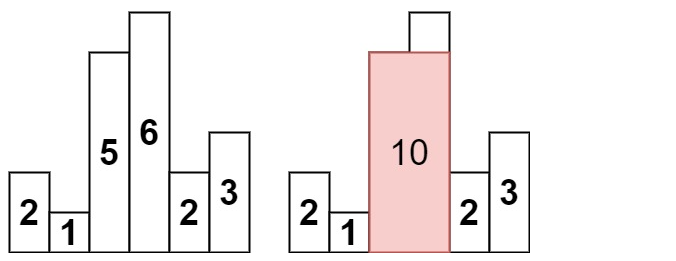

Учитывая массив целых чисел heights , представляющих высоту штриха гистограммы, где ширина каждого штриха равна 1, возвращает площадь самого большого прямоугольника на гистограмме.

 

Пример 1:

Ввод: высоты = [2,1,5,6,2,3]

Вывод: 10

Объяснение: Приведенная выше гистограмма, где ширина каждой полосы равна 1.
В красной области показан самый большой прямоугольник, площадь которого = 10 единицам.
Пример 2:

Ввод: высота = [2,4]

Вывод: 4
 

Ограничения:

1 <= heights.length <= 105
0 <= heights[i] <= 104
